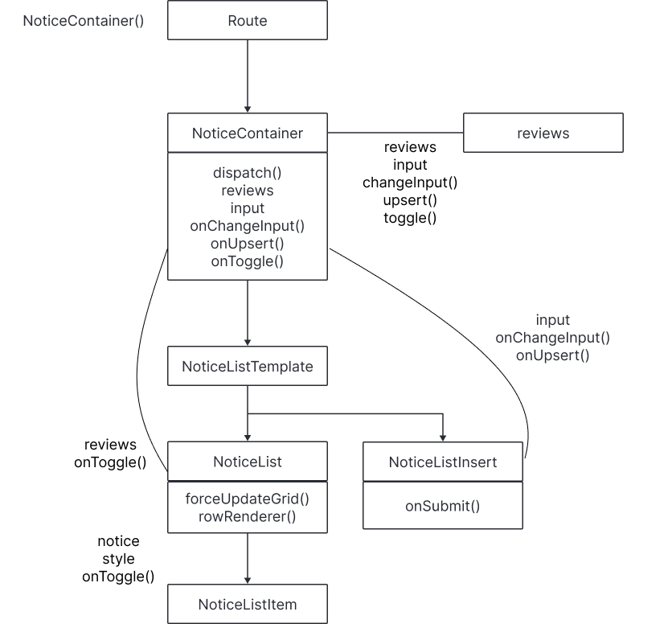

<!-- 마크다운 문서
# 대제목 ## 중제목  ### 소제목  -->

# 🏪 편의점 조합 레시피 추천 웹 애플리케이션

> **1인 가구를 위한 "편의점 조합 레시피 추천" 플랫폼**  
> 간편하게, 그리고 재미있게!  
> 편의점 식재료를 활용한 나만의 레시피를 만들어보세요 🍜

---

## 🎯 기획 의도

최근 **1인 가구의 증가**와 함께 간편하고 효율적인 식사에 대한 수요가 증가하고 있습니다.  
하지만 기존 레시피 서비스는 대부분 집밥 중심이라 **편의점 식재료를 활용한 레시피**를 찾기 어려웠습니다.

이를 해결하기 위해, 본 프로젝트는 다음과 같은 기능을 제공합니다 👇

### 🌟 주요 기능

- **🎲 랜덤 조합 추천**  
  다양한 편의점 상품 조합을 랜덤으로 제안하여 새로운 조합을 발견할 수 있습니다.
- **📍 주변 편의점 위치 안내 (Kakao Map API)**  
  사용자 위치 기반으로 주변 편의점 정보를 제공합니다.
- **📝 게시판 & 좋아요 기능**  
  자신만의 조합 레시피를 등록하고, 다른 사용자와 좋아요를 통해 소통할 수 있습니다.

> 1인 가구가 쉽고 재미있게 식사를 해결할 수 있는 플랫폼을 지향합니다.

---

## 👥 팀 구성 및 역할

|     이름      | 역할                | 주요 담당                         |                                         작업일지                                          |
| :-----------: | :------------------ | :-------------------------------- | :---------------------------------------------------------------------------------------: |
| 🌐 **김민식** | API 연동, 위치 기능 | Kakao Map API, 주변 편의점 안내   |            [작업일지](https://www.notion.so/292fc6992fc580868fbfdaba3414ec34)             |
| 🎨 **윤요엘** | UI/UX 설계          | SPA 구성, 마이페이지 구현         | [작업일지](https://www.notion.so/REACT-29279e171ce18013a933d8c1f12dbc27?source=copy_link) |
| 🧑‍💻 **전하성** | 게시판 기능         | CRUD, 무한스크롤, 더미데이터 생성 | [작업일지](https://www.notion.so/react-29258bd0f61d801b80c5efac6a6f71fe?source=copy_link) |

---

## 📦 사용 기술 및 라이브러리

### 🧰 **Frontend**

- React 18+
- Redux / React-Redux
- React Router DOM (SPA 라우팅)
- Styled-Components / SCSS
- React-Virtualized (무한스크롤)
- Axios (비동기 통신)
- React Icons
- Classnames
- Web Vitals

### 🌍 **API**

- **Kakao Map API** : 사용자 위치 기반으로 주변 편의점 위치 시각화

---

## ⚙️ 구현된 핵심 기능

### 🔧 개발 구조

- **SPA 구성**: React Router 기반 싱글 페이지 애플리케이션
- **반응형 웹**: PC / 모바일 환경 모두 대응

### 🔁 기능 구현

- **CRUD 기능**: 게시글 등록, 수정, 삭제, 목록 조회
- **무한 스크롤**: `react-virtualized`의 AutoSizer + List 조합으로 부드러운 스크롤 구현
- **외부 데이터 연동**: 더미 데이터 + Kakao API를 통한 실시간 연동

---

### 💡 상태 관리

- **Redux**: 전역 상태 관리 도입

**전역 상태로 관리되는 항목**

- 🍜 리뷰 데이터 (텍스트, 라면 + 토핑 조합)
- ❤️ 좋아요 상태
- 🎲 랜덤 메뉴 조합 (라면 1종 + 토핑 1~3종)

### 🚀 성능최적화

- **React.memo**: 불필요한 리렌더링 방지를 통한 성능 최적화
- **Lazy / Suspense 처리**: 필요할 때만 컴포넌트를 로딩하여 초기 로딩 속도 개선
- **useCallback**: 컨테이너 컴포넌트의 dispatch 함수에 useCallback을 적용해 렌더링 최적화
- **Infinite Scroll**: react-virtualized의 AutoSizer와 List를 활용해, 많은 양의 게시글도 부드럽고 효율적으로 렌더링되도록 최적화

---

## Redux 상태 관리 흐름

전역 상태로 관리되는 주요 데이터는 다음과 같습니다.

### 🍜 리뷰 데이터

- 입력된 리뷰 리스트 (텍스트, 라면 + 토핑 조합 포함)
- 좋아요(❤️) 상태 토글
- 새로운 리뷰 등록 및 기존 리뷰 수정 기능 포함

### 🎲 랜덤 데이터

- 라면 1종 + 토핑 1~3종 조합
- `getRandomMenu()` 함수를 통해 생성되어 전역 상태에 저장됨

Redux를 통해 컴포넌트 간 상태 공유가 쉬워지고,  
복잡한 데이터 흐름도 **일관성 있게 관리**할 수 있도록 구성했습니다.

### flow

### gif(pc)

## 🚀 최적화 성능비교

### 1. 최적화 전 렌더링 시간

게시판(Notice) 기준에서 측정하였습니다.

#### Render 272ms

### 2. 최적화 (React.memo / useCallback)

React.memo와 useCallback을 함께 사용하여, 불필요한 컴포넌트 리렌더링을 방지하고 렌더링 성능을 최적화했습니다.

#### Render 11.6ms

### 3. 최적화 무한스크롤 + React.memo / useCallback

무한스크롤과 리스트 가상화를 함께 적용해, 데이터를 점진적으로 불러오면서도 보이는 항목만 렌더링하여 성능을 효율적으로 최적화했습니다.

#### Render 2.6ms

---

## 🧬프로젝트 flow + UI

### 1. 메인페이지(Home)

#### 주요기능 : 랜덤으로 라면과 들어갈 토핑을 추천받는다.

🍜 라면(랜덤) ➕ 토핑(랜덤) 1 ~ 3

#### flow

#### gif(pc)

#### 스크린샷(pc)

#### 스크린샷(mobile)

### 2. 후기 작성 & 근처 편의점 찾기(Kakao Map API)

#### 주요 기능

- 후기(리뷰)를 작성합니다.
- 작성된 후기는 자동으로 게시판에 등록되어 다른 사용자들과 공유됩니다.
- 좋아요를 클릭하여 마이페이지에 조합을 저장합니다.
- KAKAO MAP API 활용하여 근처 편의점 찾기
- 주변 편의점을 탐색하여 사용자의 접근성과 편의성을 높였습니다

#### flow

#### gif(pc)

#### 스크린샷(mobile)

### 3. 게시판

#### 주요 기능

- 글을 작성 등록할 수 있습니다.
- 타인의 레시피 조합에 좋아요를 클릭하여 마이페이지에 저장할 수 있습니다.

#### flow

#### gif(pc)

#### 스크린샷(mobile)

### 4. 마이페이지

#### 주요 기능

- 사용자가 작성한 게시글을 한눈에 확인하고 관리할 수 있는 공간입니다.
- 등록한 리뷰를 수정하거나 삭제하여 자유롭게 관리할 수 있습니다.
- '좋아요' 한 레시피 조합을 모아 관리할 수 있습니다.

#### flow

#### gif(pc)

#### 스크린샷(mobile)

## 끝으로

이 프로젝트는 도전적인 아이디어에서 출발해, 단순하면서도 시대의 흐름에 맞는 콘셉트를 담았습니다. 기술적으로는 사용자 경험을 고려한 편의점 라면 조합 추천 및 리뷰 기능을 중심으로 구성되었으며, Redux 기반의 전역 상태 관리를 통해 유지 보수성과 확장성을 강화했습니다.

"작은 것이 모여 큰 변화를 만든다."

### Made by

🌐 김민식 | 🎨 전하성 | 🧑‍💻 윤요엘
